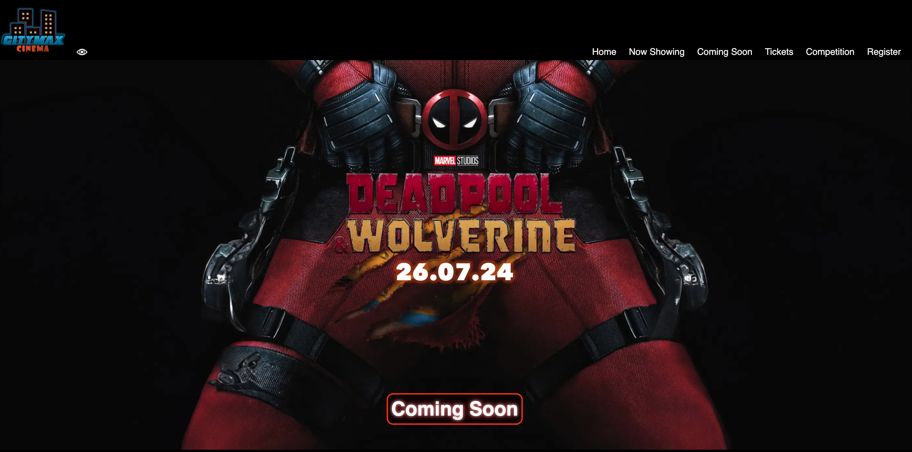
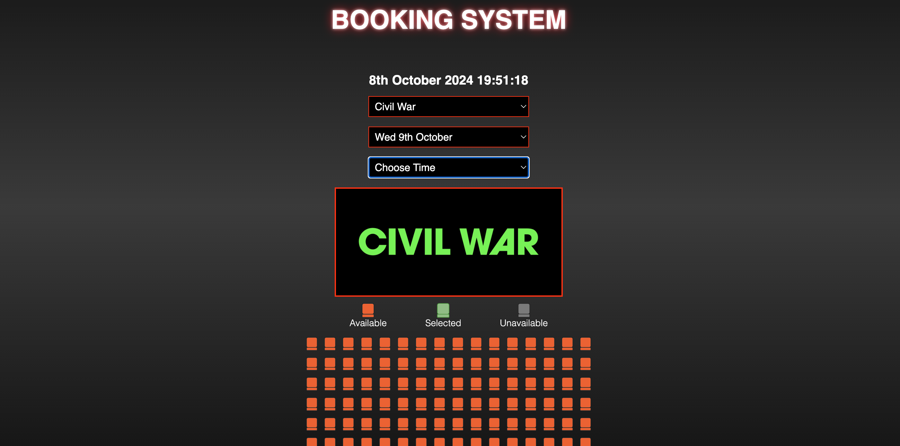
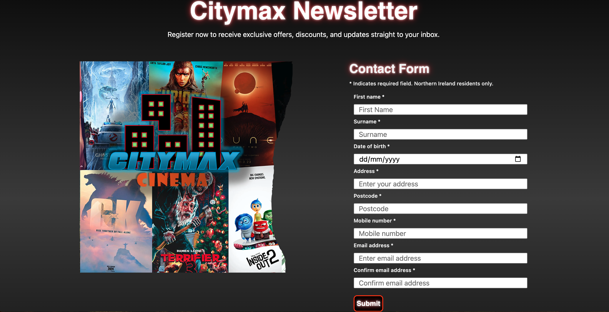

# Cinema Website

Welcome to my first website build! This project is a cinema website that includes various features to enhance user experience, such as currently showing movies, upcoming releases, a ticket booking system, form validation, and an interactive quiz.

## Screenshots

### Home Page

### Coming Soon Page

### Ticket Booking System

### Contact Form

## Features

- **Now Showing**: A section displaying the movies currently available in the cinema.
- **Coming Soon**: A preview of upcoming movie releases.
- **Ticket Booking System**: A user-friendly interface for booking tickets online, which uses local storage to replicate the functionality of a real booking system.
- **Form Validation**: Ensures all user inputs are correctly filled out before submission.
- **Quiz**: An interactive quiz for users to test their cinema knowledge.

### Important Notes

The contact form relies on the Google Maps API for the address auto-complete feature. **I have removed the Google API key from this project for security reasons.** As a result, the contact form will not work correctly without an API key. 

You can add your Google API key to the project by inserting it on **line 16** of the `contact.html` page.

**This website is best viewed on desktop, iPhone Pro Max or similar-sized mobile devices.

